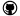

Welcome to the gg-lat documentation!
====================================
This is a documentation for `gg-lat`_ |GitHub|_.

"`gg-lat`" is a first-came-to-mind name of the project containing a bunch of Python scripts
for the :math:`\gamma\gamma` scattering cross section fitting, extrapolation and integration.

Source:
	- Check out the git repository for the source codes `on GitHub`__.
	- Or read the Python sources `right here`__

Requirements:
	#. Python_ 2.*
	#. scipy_ for fitting and integration
	#. matplotlib_ for plot.py_ usage

Basic usage:
	* see lat.py_, integrate.py_, fit.py_

__ http://github.com/neuton/gg-lat
__ _modules/index.html
.. _GitHub: http://github.com/neuton/gg-lat

.. _gg-lat: index.html
.. _Python: http://www.python.org
.. _scipy: http://www.scipy.org
.. _matplotlib: http://matplotlib.org
.. _fit.py: fit.html
.. _integrate.py: integrate.html
.. _plot.py: plot.html
.. _lat.py: lat.html
.. _gg.py: gg.html

Contents:
=========

Scripts documentation
---------------------

.. toctree::
   :maxdepth: 4

   common
   gg
   fit
   integrate
   lat
   plot

Data files
----------

The repository contains files with data values for

.. math:: \sigma_{tot}(k) = \frac{1}{2}(\sigma_0(k) + \sigma_2(k)),

where :math:`k` is a mass of a system of 2 photons (see gg.py_)

3 columns of floats stand for :math:`k\,[GeV]`, :math:`\sigma_{tot}\, [\mu b]` and absolute error, respectively.

- `data/data.dat`_ --- data from `PDG`__
- `data/pennington.dat`_ --- fit points for :math:`\pi^+ \pi^- + \pi^0 \pi^0` channels from `Pennington's article`__
- `data/full_data.dat`_ --- combined data from Pennington + PDG

Note that in `data/pennington.dat`_ errors are added artificially simply for fitting to work.

.. _data/data.dat: http://github.com/neuton/gg-lat/blob/master/data/data.dat
.. _data/full_data.dat: http://github.com/neuton/gg-lat/blob/master/data/full_data.dat
.. _data/pennington.dat: http://github.com/neuton/gg-lat/blob/master/data/pennington.dat
__ http://pdg.lbl.gov/2013/hadronic-xsections/rpp2013-gammagamma_hadronhadrons.dat
__ http://journals.aps.org/prd/abstract/10.1103/PhysRevD.90.036004

``<data_name>.dat`` files stand for raw data files containing columns of values,
while corresponding ``<data_name>`` files are for plotting like so:

>>> python plot.py data/<data_name>

Lattice data
------------

Lattice data files are stored in the `lattice`_ directory.

.. _lattice: http://github.com/neuton/gg-lat/blob/master/lattice

Indices and tables
==================

* :ref:`genindex`
* :ref:`modindex`
* :ref:`search`
